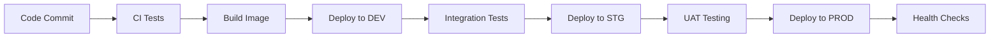

# 🏗️ DevOps Multi-Environment Architecture for 3MTT Chatbot

## 📋 Environment Strategy Overview

### **Environment Purposes**
- **Development (DEV)**: Developer workstations + shared dev environment
- **Staging (STG)**: Production-like testing environment
- **Production (PROD)**: Live user-facing environment

### **Data Flow**
```
Developer → DEV → STG → PROD
    ↓        ↓     ↓      ↓
  Local    Shared  Pre-   Live
  Testing  Testing Prod   Users
```

---

## 🔧 **Environment Configurations**

### **Development Environment**
**Purpose**: Active development, feature testing, debugging
**Characteristics**:
- Relaxed security for debugging
- Verbose logging
- Mock services where possible
- Fast iteration cycles
- Shared resources acceptable

**Infrastructure**:
- Single EC2 t3.micro instance
- Local SQLite/JSON files
- No load balancer needed
- Basic monitoring

### **Staging Environment**
**Purpose**: Production validation, integration testing, UAT
**Characteristics**:
- Production-identical configuration
- Real integrations (OpenAI, etc.)
- Performance testing
- Security validation
- Data anonymization

**Infrastructure**:
- Production-mirror setup
- Same instance types as production
- Full monitoring stack
- SSL certificates
- Load balancer (if prod has one)

### **Production Environment**
**Purpose**: Live user traffic, maximum reliability
**Characteristics**:
- High availability
- Full security hardening
- Comprehensive monitoring
- Automated backups
- Disaster recovery

**Infrastructure**:
- Multiple AZ deployment
- Auto-scaling groups
- RDS with backups
- CloudFront CDN
- WAF protection

---

## 🗂️ **Directory Structure**

```
3mtt-chatbot/
├── environments/
│   ├── dev/
│   │   ├── .env.dev
│   │   ├── docker-compose.dev.yml
│   │   ├── terraform/
│   │   └── k8s/
│   ├── staging/
│   │   ├── .env.staging
│   │   ├── docker-compose.staging.yml
│   │   ├── terraform/
│   │   └── k8s/
│   └── production/
│       ├── .env.production
│       ├── docker-compose.prod.yml
│       ├── terraform/
│       └── k8s/
├── scripts/
│   ├── deploy-dev.sh
│   ├── deploy-staging.sh
│   ├── deploy-production.sh
│   ├── promote-to-staging.sh
│   └── promote-to-production.sh
├── ci-cd/
│   ├── .github/workflows/
│   ├── jenkins/
│   └── gitlab-ci/
└── monitoring/
    ├── prometheus/
    ├── grafana/
    └── alertmanager/
```

---

## 🔐 **Security & Access Control**

### **Environment Access Matrix**
| Role | DEV | STG | PROD |
|------|-----|-----|------|
| Developers | Full | Read | None |
| DevOps | Full | Full | Full |
| QA Team | Read | Full | Read |
| Product Owner | Read | Read | Read |
| Support Team | None | Read | Read |

### **Secret Management**
- **DEV**: Local .env files, shared secrets OK
- **STG**: AWS Secrets Manager, encrypted
- **PROD**: AWS Secrets Manager, encrypted + rotated

### **Network Security**
- **DEV**: Open access, basic security groups
- **STG**: VPC, private subnets, bastion host
- **PROD**: VPC, private subnets, WAF, DDoS protection

---

## 📊 **Resource Allocation**

### **Development Environment**
```yaml
Compute:
  - EC2: t3.micro (1 vCPU, 1GB RAM)
  - Storage: 20GB GP2
  - Network: Default VPC
  
Cost: ~$10/month
Uptime: Business hours only
```

### **Staging Environment**
```yaml
Compute:
  - EC2: t3.small (2 vCPU, 2GB RAM)
  - Storage: 50GB GP3
  - Network: Custom VPC
  - RDS: db.t3.micro PostgreSQL
  
Cost: ~$50/month
Uptime: 24/7 during testing cycles
```

### **Production Environment**
```yaml
Compute:
  - EC2: t3.medium x2 (Auto Scaling)
  - Storage: 100GB GP3 + EBS snapshots
  - Network: Multi-AZ VPC
  - RDS: db.t3.small PostgreSQL (Multi-AZ)
  - ElastiCache: Redis cluster
  - CloudFront: Global CDN
  
Cost: ~$200-400/month
Uptime: 99.9% SLA
```

---

## 🚀 **Deployment Strategy**

### **Deployment Pipeline**


### **Promotion Criteria**
- **DEV → STG**: All unit tests pass, code review approved
- **STG → PROD**: UAT passed, performance tests OK, security scan clean

### **Rollback Strategy**
- **Blue-Green Deployment** for zero-downtime
- **Database migrations** with rollback scripts
- **Feature flags** for quick disable
- **Automated rollback** on health check failures

---

## 📈 **Monitoring & Observability**

### **Development**
- Basic application logs
- Simple health checks
- Local debugging tools

### **Staging**
- Full production monitoring stack
- Performance profiling
- Load testing metrics
- Security scanning results

### **Production**
- 24/7 monitoring with alerts
- APM (Application Performance Monitoring)
- Business metrics dashboard
- Incident response automation

---

## 🔄 **CI/CD Pipeline Design**

### **Continuous Integration**
```yaml
Triggers:
  - Pull Request: Run tests, security scan
  - Merge to main: Deploy to DEV
  - Tag release: Deploy to STG
  - Manual approval: Deploy to PROD

Quality Gates:
  - Unit tests: 90% coverage
  - Integration tests: All pass
  - Security scan: No high/critical issues
  - Performance tests: <2s response time
```

### **Continuous Deployment**
```yaml
DEV Deployment:
  - Automatic on merge
  - No approval required
  - Can break without impact

STG Deployment:
  - Automatic on tag
  - Smoke tests required
  - QA team notification

PROD Deployment:
  - Manual approval required
  - Change management process
  - Maintenance window (if needed)
```

---

## 🗄️ **Data Management Strategy**

### **Development Data**
- Synthetic/anonymized data
- Small dataset for fast testing
- Can be reset frequently
- No PII or sensitive data

### **Staging Data**
- Production-like volume
- Anonymized real data
- Regular refresh from production
- Data masking for sensitive fields

### **Production Data**
- Real user data
- Full backup strategy
- Encryption at rest/transit
- Compliance with data regulations
- Retention policies

---

## 🔧 **Configuration Management**

### **Environment Variables Strategy**
```bash
# Shared across all environments
APP_NAME=3MTT Chatbot
APP_VERSION=${BUILD_NUMBER}

# Environment-specific
DEV_SECRET_KEY=dev-key-not-secure
STG_SECRET_KEY=staging-secure-key
PROD_SECRET_KEY=production-ultra-secure-key

# Feature flags
FEATURE_AI_ENABLED=true
FEATURE_ANALYTICS_ENABLED=false
FEATURE_RATE_LIMITING=true
```

### **Infrastructure as Code**
- **Terraform** for infrastructure provisioning
- **Ansible** for configuration management
- **Docker** for application packaging
- **Kubernetes** for orchestration (if needed)

---

## 📋 **Operational Procedures**

### **Daily Operations**
- **DEV**: Developers deploy multiple times
- **STG**: QA team runs test suites
- **PROD**: Monitor metrics, respond to alerts

### **Weekly Operations**
- **DEV**: Environment refresh/cleanup
- **STG**: Performance testing, security scans
- **PROD**: Backup verification, capacity planning

### **Monthly Operations**
- **All Environments**: Security patching
- **PROD**: Disaster recovery testing
- **Cost optimization** review

---

## 🚨 **Incident Response**

### **Severity Levels**
- **P1 (Critical)**: Production down, data loss
- **P2 (High)**: Major feature broken, performance degraded
- **P3 (Medium)**: Minor feature issues
- **P4 (Low)**: Cosmetic issues, enhancement requests

### **Response Times**
- **P1**: 15 minutes acknowledgment, 1 hour resolution
- **P2**: 1 hour acknowledgment, 4 hours resolution
- **P3**: 4 hours acknowledgment, 24 hours resolution
- **P4**: 24 hours acknowledgment, next sprint

### **Escalation Path**
```
Alert → On-call Engineer → DevOps Lead → Engineering Manager → CTO
```

---

## 💰 **Cost Optimization**

### **Development**
- Shut down during off-hours
- Use spot instances where possible
- Shared resources across teams

### **Staging**
- Schedule-based scaling
- Use during testing cycles only
- Smaller instance sizes

### **Production**
- Right-sizing based on metrics
- Reserved instances for predictable workloads
- Auto-scaling for variable loads
- Regular cost reviews

---

## 🎯 **Success Metrics**

### **Development Velocity**
- Deployment frequency: Multiple per day
- Lead time: <1 day from code to DEV
- Mean time to recovery: <30 minutes

### **Quality Metrics**
- Test coverage: >90%
- Bug escape rate: <5%
- Security vulnerabilities: 0 high/critical

### **Operational Metrics**
- Uptime: 99.9% for production
- Response time: <2 seconds
- Error rate: <0.1%

---

## 🔄 **Migration Strategy**

### **Phase 1: Environment Setup (Week 1-2)**
1. Create environment-specific configurations
2. Set up basic CI/CD pipeline
3. Deploy to DEV environment

### **Phase 2: Staging Environment (Week 3-4)**
1. Create staging infrastructure
2. Implement automated testing
3. Set up monitoring

### **Phase 3: Production Hardening (Week 5-6)**
1. Security hardening
2. Performance optimization
3. Disaster recovery setup

### **Phase 4: Full Pipeline (Week 7-8)**
1. Complete CI/CD automation
2. Monitoring and alerting
3. Documentation and training

This architecture provides a solid foundation for scaling your 3MTT chatbot from a simple application to an enterprise-grade service with proper DevOps practices.