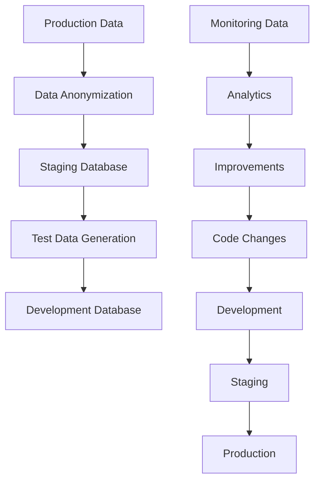

# 🏗️ Environment Comparison Matrix

## 📊 **Quick Reference Table**

| Aspect | Development | Staging | Production |
|--------|-------------|---------|------------|
| **Purpose** | Active development | Pre-production testing | Live user traffic |
| **Security** | Relaxed | Production-like | Maximum |
| **Data** | Synthetic/Mock | Anonymized real data | Real user data |
| **Monitoring** | Basic | Full stack | Enterprise-grade |
| **Uptime** | Business hours | 24/7 during testing | 99.9% SLA |
| **Cost** | ~$10/month | ~$50/month | ~$200-400/month |
| **Deployment** | Automatic on merge | Automatic on tag | Manual approval |
| **Rollback** | Not needed | Automated | Blue-green with approval |

## 🔧 **Configuration Differences**

### **Environment Variables**
```bash
# Development
SECRET_KEY=dev-secret-key-not-for-production
FLASK_DEBUG=true
LOG_LEVEL=DEBUG
MOCK_EXTERNAL_APIS=true

# Staging  
SECRET_KEY=staging-secure-key-change-in-real-deployment
FLASK_DEBUG=false
LOG_LEVEL=INFO
MOCK_EXTERNAL_APIS=false

# Production
SECRET_KEY=${SECRET_KEY_FROM_AWS_SECRETS_MANAGER}
FLASK_DEBUG=false
LOG_LEVEL=WARNING
MOCK_EXTERNAL_APIS=false
```

### **Infrastructure**
```yaml
Development:
  Compute: t3.micro (1 vCPU, 1GB)
  Database: SQLite/Local PostgreSQL
  Monitoring: Basic logs
  SSL: Self-signed or none
  
Staging:
  Compute: t3.small (2 vCPU, 2GB)
  Database: RDS PostgreSQL
  Monitoring: Full Prometheus/Grafana
  SSL: Let's Encrypt
  
Production:
  Compute: t3.medium x2 (Auto Scaling)
  Database: RDS Multi-AZ
  Monitoring: Enterprise APM + Alerting
  SSL: Commercial certificate
```

## 🚀 **Deployment Flow**

### **Development Deployment**
```bash
# Triggered by: Push to develop branch
git push origin develop
↓
CI Tests → Build Image → Deploy to DEV → Integration Tests
```

### **Staging Deployment**
```bash
# Triggered by: Push to main branch
git push origin main
↓
CI Tests → Security Scan → Deploy to STG → UAT Tests → Performance Tests
```

### **Production Deployment**
```bash
# Triggered by: Release tag
git tag v1.0.0 && git push origin v1.0.0
↓
Manual Approval → Blue-Green Deploy → Health Checks → Traffic Switch → Monitoring
```

## 🔐 **Security Levels**

### **Development**
- Basic authentication
- HTTP acceptable
- Shared secrets OK
- Open network access
- Debug mode enabled

### **Staging**
- Production-like security
- HTTPS required
- Encrypted secrets
- VPC with security groups
- Security scanning

### **Production**
- Maximum security hardening
- WAF protection
- Secrets rotation
- Network isolation
- Compliance auditing

## 📈 **Monitoring & Alerting**

### **Development**
- Application logs only
- No alerting
- Manual monitoring
- Local debugging tools

### **Staging**
- Full monitoring stack
- Performance metrics
- Load testing results
- Automated test reports

### **Production**
- 24/7 monitoring
- Real-time alerting
- Business metrics
- Incident response automation
- SLA tracking

## 🎯 **Success Criteria**

### **Development**
- Code compiles and runs
- Unit tests pass
- Basic functionality works
- Fast iteration cycles

### **Staging**
- All tests pass (unit, integration, performance)
- Security scan clean
- UAT approval
- Production-like performance

### **Production**
- Zero-downtime deployment
- All health checks pass
- Business metrics normal
- User experience maintained

## 🔄 **Data Flow Between Environments**



## 🛠️ **Quick Commands**

### **Development**
```bash
# Deploy to dev
./scripts/deploy-dev.sh

# View logs
docker-compose -f environments/dev/docker-compose.dev.yml logs -f

# Access database
docker-compose -f environments/dev/docker-compose.dev.yml exec postgres-dev psql -U chatbot_user
```

### **Staging**
```bash
# Deploy to staging
./scripts/deploy-staging.sh

# Run performance tests
ab -n 1000 -c 50 https://staging.3mtt-chatbot.com/

# Check monitoring
curl https://staging.3mtt-chatbot.com:9090/metrics
```

### **Production**
```bash
# Deploy to production (requires approval)
./scripts/deploy-production.sh

# Health check
curl https://chatbot.3mtt.gov.ng/health

# View metrics
aws cloudwatch get-metric-statistics --namespace AWS/ECS
```

This multi-environment setup provides a robust foundation for enterprise-grade development and deployment of your 3MTT chatbot.